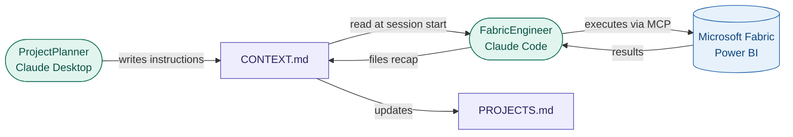

# Fabric Analytics Projects

End-to-end Microsoft Fabric analytics projects built by [Ali Saghi](https://www.linkedin.com/in/ali-saghi-fabric/),
DP-600 certified Microsoft Fabric Analytics Engineer and founder of
[Lotusoftware](https://lotusoftware.hashnode.dev) — a data analytics consultancy in Vantaa, Finland.

Each project demonstrates a full analytics workload on Microsoft Fabric: from raw data
ingestion through medallion architecture to semantic models, Power BI reports, and
real-time dashboards. All projects are built using a two-harness agentic workflow —
no manual Fabric UI work.

---

## How This Works

This repo is the **execution harness** of a two-harness agentic system. The planning
harness (Claude Desktop) reads business context and writes session instructions via the
filesystem MCP. The execution harness (Claude Code in VS Code) reads those instructions,
executes against Fabric and Power BI via MCP servers, and files a recap at session end.

The loop runs every session. `CONTEXT.md` per workspace is the handoff document — it
holds current state, known blockers, and the exact next step. `PROJECTS.md` is the
portfolio-wide registry updated after every session.

---

## Projects

### ws_Finance_Analysis — Finance Analytics Platform

**Type:** Business Intelligence + CI/CD  
**Stack:** Medallion architecture · DirectLake semantic model · Power BI report (4 pages) · Three-environment CI/CD (Dev/Test/Prod) · GitHub Actions semantic model refresh  
**Blog:** [Vibe-coding an end-to-end Finance Analytics Platform in Microsoft Fabric with Claude Code](https://lotusoftware.hashnode.dev/vibe-coding-an-end-to-end-finance-analytics-platform-in-microsoft-fabric-with-claude-code)

A complete finance analytics platform built from VS Code without touching the Fabric UI.
Covers raw CSV ingestion, star schema design, 19 DAX measures across 6 display folders,
and a full Dev → Test → Prod promotion flow with automated semantic model refresh on
every merge to main.

---

### ws_RTI_BicycleRentals — Real-Time Bicycle Network Monitor

**Type:** Real-Time Intelligence  
**Stack:** Eventstream · Eventhouse · KQL Database (187M rows) · DirectQuery semantic model · Power BI live dashboard  

Real-time operational monitoring of a bicycle rental network. KQL medallion architecture
with Bronze/Silver/Gold layers via update policies and materialized views. Semantic model
built on DirectQuery to KQL with 10 measures across 4 display folders covering
availability, capacity, rebalancing, and recency.

---

### ws_USGS_Earthquake — USGS Earthquake Analytics

**Type:** Data Engineering + Analytics  
**Stack:** REST API ingestion · Medallion Lakehouse · PySpark · reverse_geocoder · DirectLake semantic model · Power BI geospatial report  

Live USGS earthquake data ingested via REST API, processed through Bronze/Silver/Gold
Lakehouse layers with reverse geocoding and significance classification, exposed as a
4-page Power BI report with map visuals and time intelligence.

---

### ws_DS_BankChurn — Bank Customer Churn Prediction

End-to-end ML pipeline on Microsoft Fabric: raw ingestion → feature engineering →
multi-model MLflow experiment → programmatic champion selection → Direct Lake
semantic model → 3-page PBIR report → Fabric Data Agent for natural language
churn analysis.

**Stack:** PySpark · MLflow · LightGBM · scikit-learn · SMOTE · Direct Lake ·
DAX · PBIR · Fabric Data Agent

**Highlights:** Programmatic champion model selection via MLflow search_runs ·
Governed Bronze metadata logging · 10 DAX measures across 4 display folders ·
Natural language interface via agent_DS_BankChurn

---

### ws_Ecommerce_Olist — Brazilian E-Commerce Analytics

**Type:** Data Engineering + Business Intelligence  
**Stack:** Lakehouse · Fabric Warehouse (Gold schema) · Spark notebooks · DataPipeline · DirectLake semantic model · Power BI report  

Order analytics over the public Olist dataset with a Warehouse-based Gold layer
(star schema: Fact_Sales, Dim_Customers, Dim_Products, Dim_Sellers, Dim_Date,
Agg_Customer_Intelligence).

---

### ws_AdventureWorks — AdventureWorks Sales Analytics

**Type:** Data Engineering + Business Intelligence  
**Stack:** Medallion architecture · Spark notebooks · DirectLake semantic model · Power BI report  

End-to-end star schema over AdventureWorks sales data sourced from SQL Server,
built entirely from VS Code using Claude Code and Fabric skills.

---

### ws_RTI_Crypto — Live Crypto Price Intelligence

**Type:** Real-Time Intelligence  
**Stack:** Eventstream · Eventhouse · KQL Database · KQL dashboards  

Live crypto price ingestion processed in-stream and stored for historical analysis,
exposed via KQL queries and dashboards.

> **Status:** Paused — pending resolution of a `Git_GitProviderCommitRejectedByPolicy`
> error (Microsoft support ticket open). Workspace artifacts are intact.

---

## Development Stack

| Layer | Tool |
|---|---|
| AI planning agent | Claude Desktop (ProjectPlanner) |
| AI execution agent | Claude Code in VS Code (FabricEngineer) |
| Fabric operations | fabric-mcp (custom Python MCP server) |
| Semantic model / DAX | powerbi-modeling-mcp (XMLA endpoint) |
| Fabric skills | skills-for-fabric (CLAUDE.md) |
| Context management | PROJECTS.md + ws_\<name\>/CONTEXT.md |
| Git strategy | dev-fabric-sync → test → main (PR-based promotion) |
| CI/CD | GitHub Actions — semantic model refresh on merge to main |

---

## Workflow Reference

- [`PROJECTS.md`](./PROJECTS.md) — living project registry, updated by agents after every session
- `ws_<name>/CONTEXT.md` — per-project session handoff document, read at session start and written at session end
- Two-harness methodology: [Stop Re-Prompting: Your Second Brain Should Write Your Agent's Instructions](https://lotusoftware.hashnode.dev/stop-re-prompting-how-i-built-a-two-harness-agentic-workflow-for-microsoft-fabric)

---

## About Lotusoftware

Lotusoftware is a data analytics consultancy founded by Ali Saghi in Vantaa, Finland,
specialising in Microsoft Fabric, Power BI, and agentic analytics systems.

- Blog: [lotusoftware.hashnode.dev](https://lotusoftware.hashnode.dev)
- LinkedIn: [ali-saghi-fabric](https://www.linkedin.com/in/ali-saghi-fabric/)
- GitHub: [alisaghilutfi](https://github.com/alisaghilutfi)
- X: [@alis05111](https://x.com/alis05111)