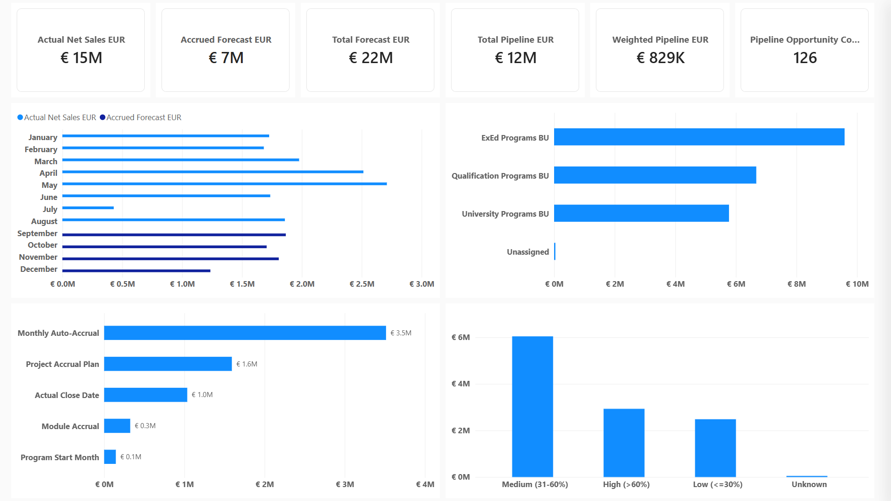
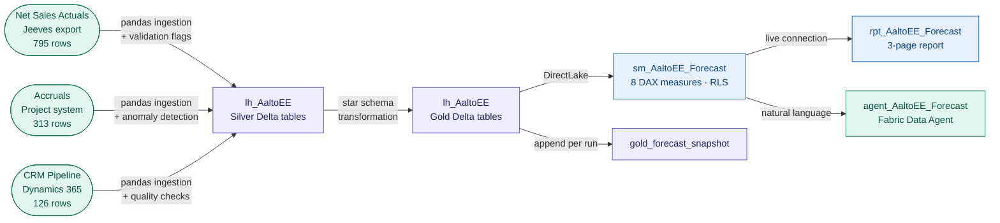

# ws_AaltoEE_Forecast — Aalto EE Net Sales Forecasting Model

An end-to-end Microsoft Fabric analytics project built on real organisational
data from Aalto University Executive Education. Covers three-source data
ingestion, Silver validation with documented anomaly flags, Gold star-schema
transformation, DirectLake semantic modelling, a three-page Power BI report,
a forecast snapshot table, and a natural language Data Agent — all on a single
Fabric F2 capacity.

This project was built as a pre-assignment for a Data Analyst/Engineer role
application. The source data covers Aalto EE's 2026 net sales actuals,
accrued forecast, and CRM pipeline, and demonstrates how a governed Fabric
medallion pipeline produces a more accurate forecast than the existing manual
Excel consolidation process.

---

## The Problem

Aalto EE's net sales forecast combines three data sources — actuals from the
accounting system (Jeeves), accruals from the project delivery system, and CRM
pipeline from Dynamics 365. Today those three are consolidated manually in Excel
every month. That process has three systematic risks.

**No single source of truth.** Power BI, Qlik Sense, and Excel can show
different numbers for the same period because they refresh at different times
from different connections.

**No audit trail.** When a figure in the FT ranking submission is questioned,
there is no way to trace it back to its source row.

**Silent data loss.** The existing manual deduplication step was incorrectly
removing €341,225.79 of legitimate accrual data across four projects, and
€42,550.00 of unassigned accruals were being dropped entirely. The pipeline
surfaces both as named validation flags rather than silently discarding them.

---

## Architecture

---

## Key Technical Decisions

**Pipeline recovers €383,775 of previously lost data** — the manual Excel
deduplication used a key that excluded the amount column, causing rows with
different forecast values to collapse into one. The pipeline replaces this with
named validation flags (UNASSIGNED_BU, ZERO_FORECAST, ALLOCATION_EXCEEDS_100PCT)
that surface anomalies for Finance review rather than silently dropping rows.

**11/11 acceptance checks pass on every run** — `nb_AaltoEE_03_validate`
reconciles every Gold table against source control totals from the reevaluation
document: 795 rows · €14,635,067.81 for actuals, 313 rows · €6,616,025.78 for
accruals, 126 rows · €828,900.00 for pipeline. Each check is named and the
overall result is logged as PASS or FAIL.

**Dim BU as a governed filter hub** — a four-row Dim BU table (three BUs +
Unassigned) connects to all three fact tables via single-direction relationships.
This ensures the BU slicer propagates correctly across actuals, accruals, and
pipeline simultaneously — a filter architecture defect in the original manual
model that caused BU bars to show inflated values up to 2.7× the correct figure.

**Snapshot table appended on every pipeline run** — `gold_forecast_snapshot`
stores a summarised freeze of the forecast (BU × month × component) with a
version timestamp on each run. Finance can compare version 1 against version 2
to see exactly what changed between pipeline runs — the foundation for a full
forecast revision history.

**DirectLake on Gold Delta tables** — the semantic model reads directly from
Gold tables in OneLake with no import refresh cycle. The `_Measures` calculated
table pattern keeps all DAX in one place; raw Silver columns are hidden from
report view.

**RLS with three roles** — Finance sees all BUs; Programme_Manager_ExEd is
filtered to ExEd Programs BU through the Dim BU dimension, propagating to all
three fact tables automatically; Ranking_Team role defined for FT submission
data access.

**Dim Date covers 2024–2028** — the original date dimension covered only 2026,
leaving pipeline opportunities (which close between 2024 and 2028) unconnected
to the calendar. Extending to 60 monthly rows enables correct date filtering
for all three fact tables.

---

## Data Quality Findings

Five named validation flags are surfaced by the pipeline rather than silently
corrected or dropped. Each one requires Finance confirmation before the data
is promoted.

| Flag | Table | Count | Amount | Finding |
| ---- | ----- | ----- | ------ | ------- |
| `NEGATIVE_NET_SALES` | silver_net_sales | 16 rows | −€45,333.90 | Legitimate credit notes and revenue reversals. Preserved — dropping would overstate actuals. |
| `ZERO_NET_SALES` | silver_net_sales | 102 rows | €0.00 | Projects tracked in accounting with no revenue recognised that month. Preserved. |
| `UNASSIGNED_BU` | silver_accruals | 4 rows | €42,550.00 | Project O7401201 has no BU assignment. Mapping candidate: ExEd Programs BU (same project appears in actuals under ExEd). |
| `MISSING_PROBABILITY` | silver_pipeline | 2 rows | €50,000 unweighted | Null probability treated as 0% for weighted calculation. Finance must assign probability. |
| `ALLOCATION_EXCEEDS_100PCT` | silver_pipeline | 1 row | — | Opportunity 111: 30% this year + 80% next year = 110%. Mathematically impossible. Requires source correction in Dynamics 365. |

The deduplication review also identified four projects with multiple accrual
lines for the same project/month combination (L9109051, L9109067, O7401158,
P8202082), totalling €341,225.79 of previously removed data. These are preserved
in the 313-row Silver table pending a Finance duplicate decision.

---

## What Was Built

| Artifact | Type | Description |
| -------- | ---- | ----------- |
| `lh_AaltoEE` | Lakehouse | Single lakehouse — Bronze (Excel files), Silver (3 cleaned tables), Gold (5 fact/dim tables + snapshot) |
| `nb_AaltoEE_01_ingest` | Notebook | pandas — reads Bronze Excel, applies Silver transformations, writes Delta tables, validation flags |
| `nb_AaltoEE_02_transform` | Notebook | PySpark — reads Silver, builds Gold star schema, appends forecast snapshot |
| `nb_AaltoEE_03_validate` | Notebook | 11 acceptance checks against source control totals — row counts, monetary totals, referential integrity |
| `pl_AaltoEE_Build` | Data Pipeline | Orchestrates ingest → transform → validate in sequence. Each step only runs if the previous succeeded. Runtime: ~6 minutes. |
| `sm_AaltoEE_Forecast` | Semantic model | DirectLake · `_Measures` table · 8 DAX measures · 3 display folders · 3 RLS roles · Dim BU + Dim Date (2024–2028) |
| `rpt_AaltoEE_Forecast` | Report | 3-page report — Overview, Monthly Forecast, Pipeline Analysis |
| `agent_AaltoEE_Forecast` | Data Agent | Fabric Data Agent grounded on `sm_AaltoEE_Forecast` — natural language forecast queries |

---

## Lakehouse Table Inventory

| Table | Layer | Rows | Amount | Notes |
| ----- | ----- | ---- | ------ | ----- |
| silver_net_sales | Silver | 795 | €14,635,067.81 | Jan–Aug 2026 actuals |
| silver_accruals | Silver | 313 | €6,616,025.78 | Sep–Dec 2026 accrued forecast |
| silver_pipeline | Silver | 126 | €828,900.00 | Weighted pipeline this year |
| gold_dim_bu | Gold | 4 | — | ExEd, Qualification, University, Unassigned |
| gold_dim_date | Gold | 60 | — | Jan 2024 – Dec 2028, monthly grain |
| gold_fact_net_sales | Gold | 795 | €14,635,067.81 | Joined with Dim Date + Dim BU |
| gold_fact_accruals | Gold | 313 | €6,616,025.78 | Joined with Dim Date + Dim BU |
| gold_fact_pipeline | Gold | 126 | €828,900.00 | Joined with Dim BU, Est_Closing_Date → Dim Date |
| gold_forecast_snapshot | Gold | 43+ | — | Appended per pipeline run. Version: YYYYMMDD_HHMMSS |

**Total Forecast EUR from Gold layer: €22,079,993.59**
(€383,775 higher than the manual Excel process — recovered data.)

---

## Semantic Model — DAX Measure Library

8 measures across 3 display folders, all using `VAR`/`RETURN` pattern with
Copilot descriptions. Silver ingestion metadata columns hidden from report view.

| Display folder | Measure | What it answers |
| -------------- | ------- | --------------- |
| Actuals | `Actual Net Sales EUR` | Total net sales Jan–Aug 2026 |
| Forecast | `Accrued Forecast EUR` | Total accrued forecast Sep–Dec 2026 |
| Forecast | `Total Forecast EUR` | Actuals + Accruals + Weighted Pipeline (COALESCE pattern) |
| Pipeline | `Weighted Pipeline EUR` | Probability-weighted CRM pipeline value for 2026 |
| Pipeline | `Total Pipeline EUR` | Unweighted total pipeline value |
| Pipeline | `Pipeline Opportunity Count` | Count of open CRM opportunities |
| Snapshots | `Latest Snapshot Total EUR` | Total from the most recent pipeline run version |
| Snapshots | `Snapshot Version Count` | Number of distinct pipeline run versions stored |

---

## Relationships

| From | To | Cardinality | Direction | Notes |
| ---- | -- | ----------- | --------- | ----- |
| gold_dim_date[Date] | gold_fact_net_sales[Date] | 1:* | Single | Month-level filter |
| gold_dim_date[Date] | gold_fact_accruals[Date] | 1:* | Single | Month-level filter |
| gold_dim_date[Date] | gold_fact_pipeline[Est_Closing_Date] | 1:* | Single | Closing date filter 2024–2028 |
| gold_dim_bu[BU_Name] | gold_fact_net_sales[BU] | 1:* | Single | BU slicer propagation |
| gold_dim_bu[BU_Name] | gold_fact_accruals[BU] | 1:* | Single | BU slicer propagation |
| gold_dim_bu[BU_Name] | gold_fact_pipeline[BU] | 1:* | Single | BU slicer propagation |

No date relationship on `gold_forecast_snapshot` — the snapshot table is
queried by version timestamp, not by calendar month. A date relationship on a
column containing nulls (Pipeline rows have no monthly grain) would cause
unexpected filter behaviour.

---

## Report Pages

**Page 1 — Overview**
Five KPI cards (Actual Net Sales EUR, Accrued Forecast EUR, Total Forecast EUR,
Weighted Pipeline EUR, Pipeline Opportunity Count), BU tile slicer, monthly
horizontal bar chart (actuals vs accruals Jan–Dec), and BU stacked bar chart
(Total Forecast by Business Unit). Page-level filter: Year = 2026.

**Page 2 — Monthly Forecast**
Month tile slicer, BU tile slicer, four KPI cards, monthly column chart
(actuals vs accruals), accrual breakdown table (BU × Accrual Type × Amount),
and accrual method bar chart. Page-level filter: Year = 2026.

**Page 3 — Pipeline Analysis**
Three KPI cards, Closing Year slicer (uses gold_fact_pipeline[Closing_Year]
to avoid Dim Date range mismatch), pipeline value by probability column chart,
BU × Probability Band stacked bar chart, and open opportunities detail table
sorted by Weighted Value This Year descending.

---

## Production Ingestion Path

In the prototype, Excel files are manually uploaded to `Files/Bronze/`. In
production, the three ingestion paths are:

- **Dynamics 365 / Dataverse** → Native Dataverse shortcut in the Lakehouse
  Tables section. Mirrors opportunity and account tables as read-only Delta
  tables on a schedule. No custom API code.
- **Net sales actuals** (Jeeves export) → SharePoint folder connector.
  Finance saves the monthly export to a monitored SharePoint folder. Fabric
  Data Pipeline picks it up automatically.
- **FT ranking surveys** → Same SharePoint folder pattern. Mia saves the
  survey export and the pipeline triggers without manual intervention.

Both the Dataverse shortcut and SharePoint folder connectors are available in
the ws_AaltoEE_Forecast Fabric capacity and were verified during development.

---

## How to Explore This Project

- **Notebooks:** three-stage pipeline — `nb_AaltoEE_01_ingest` →
  `nb_AaltoEE_02_transform` → `nb_AaltoEE_03_validate`
- **Pipeline:** run `pl_AaltoEE_Build` to execute all three notebooks in
  sequence and append a new forecast snapshot version
- **Semantic model:** `_Measures` table contains all 8 DAX measures
- **Report:** three pages covering executive overview, monthly forecast
  detail, and CRM pipeline analysis
- **Data Agent:** ask `agent_AaltoEE_Forecast` questions like
  *"What is the total full-year forecast for 2026?"* or
  *"What is the accrued forecast for September 2026?"*
- **`CONTEXT.md`** — session handoff document with decisions, current state,
  and next planned steps

---

## Context

Built by [Ali Saghi](https://www.linkedin.com/in/ali-saghi-fabric/) ·
[Lotusoftware](https://lotusoftware.hashnode.dev) · September 2026

Pre-assignment for the Aalto EE Data Analyst/Engineer role application.
Built in four days on real organisational data using the two-harness agentic
workflow described in this
[blog post](https://lotusoftware.hashnode.dev/stop-re-prompting-how-i-built-a-two-harness-agentic-workflow-for-microsoft-fabric).
