# ws_AdventureWorks — AdventureWorks Sales Analytics

An end-to-end sales analytics platform built on the AdventureWorksLT2022 dataset,
sourced from SQL Server via CSV export and processed through a Bronze/Silver/Gold
medallion Lakehouse architecture into a DirectLake semantic model and Power BI report.

<!-- Replace the line below with your screenshot once captured -->
<!--  -->

---

## The Problem

AdventureWorks is a fictional bicycle manufacturer with sales data spanning products,
customers, addresses, and orders. The goal is a governed analytics platform demonstrating
end-to-end data engineering from a SQL Server source — CSV extraction, medallion
processing, star schema construction, and a DirectLake semantic model — representative
of the pattern used in real enterprise SQL Server to Fabric migrations.

---

## Architecture

```mermaid
flowchart LR
    A([AdventureWorksLT2022\nSQL Server via CSV]) -->|nb_Bronze\nraw ingest| B[lh_AdventureWorks\nBronze Delta tables]
    B -->|nb_Silver\nclean + conform| C[lh_AdventureWorks\nSilver Delta tables]
    C -->|nb_Gold\nstar schema| D[lh_AdventureWorks\nGold star schema tables]
    D -->|DirectLake| E[sm_AdventureWorks\nSemantic model]
    E -->|live connection| F[rpt_AdventureWorks\nPower BI report]

    style A fill:#E1F5EE,stroke:#0F6E56,color:#085041
    style B fill:#EEEDFE,stroke:#534AB7,color:#26215C
    style C fill:#EEEDFE,stroke:#534AB7,color:#26215C
    style D fill:#EEEDFE,stroke:#534AB7,color:#26215C
    style E fill:#E6F1FB,stroke:#185FA5,color:#0C447C
    style F fill:#E6F1FB,stroke:#185FA5,color:#0C447C
```



### Gold star schema

```
gold_sales_fact         ←→  gold_dim_customer       (CustomerID)
gold_sales_fact         ←→  gold_dim_product        (ProductID)
gold_sales_fact         ←→  gold_dim_productcategory (ProductCategoryID)
gold_sales_fact         ←→  gold_dim_address        (ShipToAddressID)
```

---

## Key Technical Decisions

**CSV export from SQL Server — headerless by default** — AdventureWorksLT2022 was
exported from `LAPTOP-B5CG4JFI\SQLEXPRESS` via SSMS. SSMS CSV exports are headerless;
the Bronze notebook supplies column names explicitly rather than inferring from the
file. This is the correct pattern for SSMS-exported source data.

**Three-notebook medallion — one notebook per layer** — Bronze ingests raw CSVs as-is
into Delta, Silver cleans and conforms, Gold constructs the star schema with explicit
fact/dimension separation. Each notebook is independently runnable with a defined input
and output, making the pipeline debuggable layer by layer.

**All three medallion layers in a single Lakehouse** — unlike the Ecommerce project
(separate Bronze/Silver Lakehouses), AdventureWorks uses one Lakehouse with table
naming conventions (`bronze_`, `silver_`, `gold_`) to separate layers. Simpler topology
for a dataset of this scale.

---

## What Was Built

| Artifact | Type | Description |
|---|---|---|
| `nb_AdventureWorks_Bronze` | Notebook | Ingests headerless CSVs from SQL Server export into Bronze Delta tables |
| `nb_AdventureWorks_Silver` | Notebook | Cleans and conforms Bronze tables into Silver layer |
| `nb_AdventureWorks_Gold` | Notebook | Constructs star schema: `gold_sales_fact`, `gold_dim_customer`, `gold_dim_product`, `gold_dim_productcategory`, `gold_dim_address` |
| `lh_AdventureWorks` | Lakehouse | Single Lakehouse holding all three medallion layers |
| `sm_AdventureWorks` | Semantic model | DirectLake on Gold tables — TMDL generated and committed to Git |
| `rpt_AdventureWorks` | Report | Power BI report on the AdventureWorks star schema |

> **Note:** The semantic model Git sync was committed with an incorrect Lakehouse GUID
> (`a68f2b2d`) which has since been corrected. Sync against the live workspace has not
> yet been verified — this is the next planned session's first task.

---

## How to Explore This Project

- **Source data:** CSV exports from AdventureWorksLT2022 at
  `C:\Users\alisa\Source\Data\AdventureWorks\data\` (local only, not in repo)
- **Medallion notebooks:** `nb_AdventureWorks_Bronze/Silver/Gold.Notebook/` —
  full PySpark transformation logic per layer
- **Semantic model:** `sm_AdventureWorks.SemanticModel/definition/` — TMDL files
  for the Gold star schema tables and relationships
- **`CONTEXT.md`** is the agent session handoff document — records the GUID fix,
  current sync verification status, and next planned step
