# ws_DS_BankChurn — Bank Customer Churn Prediction

An end-to-end data science and machine learning project on Microsoft Fabric predicting
customer churn for a bank. Covers data ingestion, feature engineering, model training
with three algorithms, champion model selection via MLflow, prediction scoring, and a
Power BI dashboard surfacing churn rate, risk segmentation, and model performance.

<!-- Replace the line below with your screenshot once captured -->
<!--  -->

---

## The Problem

A bank needs to identify customers at high risk of leaving before they churn — not after.
Reactive retention is expensive; proactive retention requires a reliable prediction model
built on historical customer behaviour. The goal is an ML pipeline that trains, evaluates,
and registers a champion model, scores current customers, and surfaces the predictions in
a Power BI report that risk and retention teams can act on directly.

---

## Architecture

```mermaid
flowchart LR
    A([churn.csv\nraw customer data]) -->|nb_transformData| B[lh_DS_BankChurn\nchurn_clean Delta table]
    B -->|nb_TrainRegisterML\nRFC1 · RFC2 · LightGBM| C[bank-churn-experiment\nMLflow experiment]
    C -->|champion selection\nROC-AUC evaluation| D[champion_BankChurn\nMLModel registry]
    D -->|nb_Predictions\nscore churn_test| E[customer_churn_test_predictions\nDelta table]
    E -->|DirectLake| F[sm_DS_BankChurn\n10 DAX measures]
    F -->|live connection| G[rpt_DS_BankChurn\n3-page report]

    style A fill:#E1F5EE,stroke:#0F6E56,color:#085041
    style B fill:#EEEDFE,stroke:#534AB7,color:#26215C
    style C fill:#FAEEDA,stroke:#854F0B,color:#633806
    style D fill:#FAEEDA,stroke:#854F0B,color:#633806
    style E fill:#EEEDFE,stroke:#534AB7,color:#26215C
    style F fill:#E6F1FB,stroke:#185FA5,color:#0C447C
    style G fill:#E6F1FB,stroke:#185FA5,color:#0C447C
```

---

## Key Technical Decisions

**Three models trained, champion selected programmatically** — Random Forest (two
variants) and LightGBM are trained and evaluated on a validation set using ROC-AUC.
The champion (`lgbm_sm`) is registered as `champion_BankChurn` in the MLflow model
registry via code, not by manual selection in the Fabric UI. This makes the selection
reproducible and auditable.

**`delta.columnMapping.mode=name` baked into the predictions write** — the
`customer_churn_test_predictions` table is written with column mapping enabled at
creation time. Required for DirectLake to frame the table correctly — cannot be
retrofitted after the table exists.

**Standalone `_Measures` table, not implicit measures** — all 10 DAX measures live in a
dedicated `_Measures` calculated table. Raw columns on `customer_churn_test_predictions`
are hidden (11 columns hidden); only business-ready measures and key dimension columns
are exposed to report authors.

**MLModel naming follows Microsoft tutorial convention** — the three trained models
(`rfc1_sm`, `rfc2_sm`, `lgbm_sm`) use the tutorial naming pattern with `_sm` suffix.
Future projects in this portfolio use a `model_` prefix. The models were not renamed to
avoid breaking notebook cell references that load them by registered name.

---

## What Was Built

| Artifact | Type | Description |
|---|---|---|
| `nb_DS_BankChurn_transformData` | Notebook | Downloads `churn.csv`, cleans data, engineers features, writes `churn_clean` Delta table |
| `nb_DS_BankChurn_TrainRegisterML` | Notebook | Trains RFC1, RFC2, LightGBM; evaluates on validation set ROC-AUC; registers champion programmatically |
| `nb_DS_BankChurn_Predictions` | Notebook | Loads `champion_BankChurn`, scores `churn_test`, writes `customer_churn_test_predictions` with column mapping |
| `lh_DS_BankChurn` | Lakehouse | Holds `churn_clean` (feature-engineered) and `customer_churn_test_predictions` as Delta tables |
| `bank-churn-experiment` | ML Experiment | MLflow experiment tracking all training runs across three algorithms |
| `rfc1_sm`, `rfc2_sm`, `lgbm_sm` | ML Models | Three trained model variants registered in Fabric model registry |
| `champion_BankChurn` | ML Model | Programmatically selected champion (LightGBM) — the model used for scoring |
| `sm_DS_BankChurn` | Semantic model | DirectLake on predictions table · 10 DAX measures · 4 display folders · 11 raw columns hidden |
| `rpt_DS_BankChurn` | Report | 3-page churn dashboard · PBIR format · 15 visuals |

---

## Semantic Model — DAX Measure Library

10 measures across 4 display folders. Raw encoded and ID columns hidden; only
business-ready measures and categorical columns exposed.

| Display folder | What it answers |
|---|---|
| Volume | Total customers scored, count by churn prediction outcome |
| Churn Rate | Overall predicted churn rate, rate by segment |
| Geography | Churn distribution by country/geography |
| Risk Signals | Average credit score, balance, and tenure among predicted churners vs retained |

---

## Report Pages

| Page | Focus |
|---|---|
| Churn Overview | Network-wide churn rate KPIs, volume by prediction outcome, geography distribution |
| Risk Profile | Risk signal breakdown — credit score, balance, tenure, product count among churners |
| Model Performance | ROC-AUC scores across the three trained models, champion vs challenger comparison |

---

## How to Explore This Project

- **ML pipeline:** The three training notebooks follow a progressive structure —
  `transformData` → `TrainRegisterML` → `Predictions`. Each is self-contained and
  parameterised
- **Model registry:** `champion_BankChurn` is the registered champion; the experiment
  log in `bank-churn-experiment` shows all training runs with metrics
- **Semantic model:** `sm_DS_BankChurn.SemanticModel/definition/tables/_Measures.tmdl`
  contains all 10 DAX measures with Copilot descriptions
- **Report:** `rpt_DS_BankChurn.Report/definition/pages/` — PBIR visual JSON per page
- **`CONTEXT.md`** is the agent session handoff document — records the ML decisions,
  current open items (geography chart fix, pipeline orchestration), and next planned step
