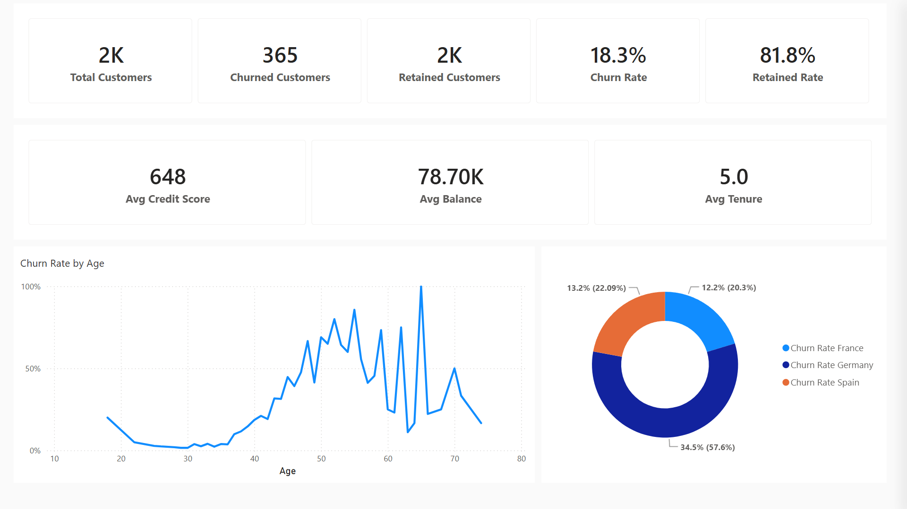

# ws_DS_BankChurn — Bank Customer Churn Prediction

An end-to-end data science project on Microsoft Fabric covering raw data
ingestion, feature engineering, multi-model ML training with MLflow experiment
tracking, programmatic champion model selection, Direct Lake semantic modelling,
a three-page Power BI report, and a natural language Data Agent — all on a single
Fabric F2 capacity.

---

## The Problem

A retail bank needs to identify which customers are likely to churn before they
leave. Manual analysis of customer data is slow and inconsistent. The goal is an
automated ML pipeline that scores customers, surfaces churn risk signals through
a governed semantic model, and lets business users query predictions in plain
language — without needing a data scientist in the loop.

---

## Architecture

```mermaid
flowchart LR
    A([churn.csv\nPublic demo dataset]) -->|PySpark ingestion + metadata logging| B[lh_DS_BankChurn\nchurn_clean Delta table]
    B -->|Feature engineering + SMOTE| C[ML Experiment\nRFC x2 · LightGBM]
    C -->|Programmatic champion selection\nval ROC-AUC| D[champion_BankChurn\nMLModel]
    D -->|Batch scoring| E[customer_churn_test_predictions\nGold Delta table]
    E -->|DirectLake| F[sm_DS_BankChurn\n10 DAX measures]
    F -->|Live connection| G[rpt_DS_BankChurn\n3-page report]
    F -->|Natural language| H[agent_DS_BankChurn\nFabric Data Agent]

    style A fill:#E1F5EE,stroke:#0F6E56,color:#085041
    style B fill:#EEEDFE,stroke:#534AB7,color:#26215C
    style C fill:#EEEDFE,stroke:#534AB7,color:#26215C
    style D fill:#EEEDFE,stroke:#534AB7,color:#26215C
    style E fill:#EEEDFE,stroke:#534AB7,color:#26215C
    style F fill:#E6F1FB,stroke:#185FA5,color:#0C447C
    style G fill:#E6F1FB,stroke:#185FA5,color:#0C447C
    style H fill:#E1F5EE,stroke:#0F6E56,color:#085041
```

---

## Key Technical Decisions

**SMOTE applied to training split only** — synthetic oversampling addresses the
class imbalance (~20% churn) without contaminating the validation or test sets.
Validation set ROC-AUC is computed on the original distribution, making model
comparison meaningful.

**Programmatic champion selection via MLflow** — all three candidate models
(RFC max_depth=4, RFC max_depth=8, LightGBM) are tracked in the
`bank-churn-experiment` MLExperiment. The champion is selected by querying
`mlflow.search_runs` ordered by `val_roc_auc DESC` and registered as
`champion_BankChurn`. No hardcoded model name in the scoring notebook.

**DirectLake on scored predictions** — the semantic model frames directly against
the `customer_churn_test_predictions` Gold Delta table. `delta.columnMapping.mode=name`
is set at write time to prevent DirectLake framing failures if the feature set changes.

**Governed Bronze ingestion metadata** — every notebook run writes a metadata row
to `ingestion_metadata` Delta table recording run timestamp, source URL, row count,
column count, Spark application ID, and schema version. Supports auditability of
the ML training data lineage.

**_Measures calculated table pattern** — all 10 DAX measures live in a dedicated
`_Measures` table, keeping the predictions table clean and the field pane readable.
Raw one-hot encoded columns (Geography_*, Gender_*) and engineered score columns
(New*Score) are hidden from report view.

**Fabric Data Agent grounded on semantic model** — `agent_DS_BankChurn` is
published and grounded on `sm_DS_BankChurn`, allowing business users to query
churn predictions in plain language. No custom API or Teams connector required
for the core capability.

---

## What Was Built

| Artifact | Type | Description |
|---|---|---|
| `nb_DS_BankChurn_transformData` | Notebook | PySpark — CSV ingestion, feature engineering, Bronze metadata logging, writes `churn_clean` |
| `nb_DS_BankChurn_TrainRegisterML` | Notebook | MLflow — trains RFC x2 + LightGBM, logs val ROC-AUC, selects and registers `champion_BankChurn` |
| `nb_DS_BankChurn_Predictions` | Notebook | Loads `champion_BankChurn`, scores `churn_test`, writes `customer_churn_test_predictions` with columnMapping |
| `lh_DS_BankChurn` | Lakehouse | Single lakehouse — `churn_clean`, `churn_test`, `customer_churn_test_predictions`, `ingestion_metadata` Delta tables |
| `bank-churn-experiment` | MLExperiment | Tracks all model training runs with val ROC-AUC metrics |
| `rfc1_sm`, `rfc2_sm`, `lgbm_sm` | MLModel | Three candidate models (tutorial naming convention) |
| `champion_BankChurn` | MLModel | Programmatically selected champion — registered via MLflow search_runs |
| `sm_DS_BankChurn` | Semantic model | DirectLake · `_Measures` table · 10 DAX measures · 4 display folders · 11 hidden columns · Copilot descriptions |
| `rpt_DS_BankChurn` | Report | 3-page PBIR report — Churn Overview, Risk Profile, Model Performance |
| `agent_DS_BankChurn` | Data Agent | Fabric Data Agent grounded on `sm_DS_BankChurn` — natural language churn analysis |

---

## Semantic Model — DAX Measure Library

10 measures across 4 display folders, all using `VAR`/`RETURN` pattern with
Copilot descriptions. One-hot encoded and engineered columns hidden from report view.

| Display folder | What it answers |
|---|---|
| Volume | Total, churned, and retained customer counts |
| Churn Rate | Overall churn rate and retained rate |
| Geography | Churn rate by Germany, Spain, and France |
| Risk Signals | Average credit score, balance, and tenure |

---

## Key Insights from the Model

- **18.3% overall churn rate** across 2,000 scored test customers
- **Germany churns at 34.5%** — nearly 3× the French rate (12.2%)
- **Products 3–4 drive near-100% churn** — customers with 3 or 4 products are
  almost certain to churn, a strong signal for product portfolio management
- **Inactive members churn at significantly higher rates** — activity status is
  a leading indicator of churn risk
- **Churn peaks between ages 40–65** — the highest-value customer segment

---

## How to Explore This Project

- **Notebooks:** three-stage pipeline — transform → train/register → predict
- **Semantic model:** `sm_DS_BankChurn.SemanticModel/definition/tables/_Measures.tmdl`
  contains all 10 DAX measures
- **Report:** `rpt_DS_BankChurn.Report/definition/pages/` — three pages, 15 visuals
- **Data Agent:** `agent_DS_BankChurn` in the Fabric workspace — ask it questions
  like "What is the churn rate for inactive German customers?"
- **`CONTEXT.md`** — session handoff document with decisions, current state, and
  next planned steps
