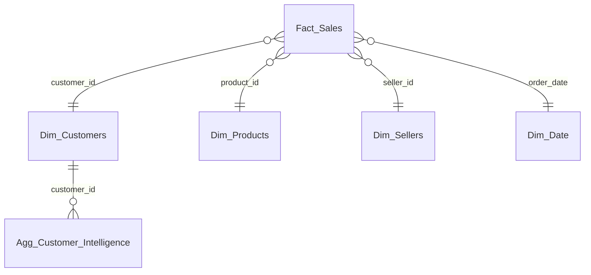

# ws_Ecommerce_Olist — Brazilian E-Commerce Analytics

An end-to-end analytics solution on the public Olist Brazilian e-commerce dataset,
combining a Lakehouse-based medallion architecture (Bronze/Silver) with a Fabric
Warehouse Gold layer (star schema) and a Power BI semantic model and report on top.
Demonstrates the Lakehouse + Warehouse hybrid pattern — PySpark for raw ingestion and
transformation, T-SQL for governed Gold schema management.

<!-- Replace the line below with your screenshot once captured -->
<!--  -->

---

## The Problem

The Olist dataset contains Brazilian e-commerce orders across multiple sellers,
products, customers, and geographies. Raw, it spans several CSVs with no common
grain or unified key structure. The goal is a governed analytics platform that
consolidates raw order data into a star schema Gold layer and surfaces it in a
Power BI report answering: how is sales revenue trending, which sellers and products
are performing, and what does customer behaviour look like?

---

## Architecture

```mermaid
flowchart LR
    A([Olist public\ndataset CSVs]) -->|nb_Bronze\nraw ingest| B[lh_Ecommerce_Olist\nBronze Delta tables]
    B -->|nb_Silver\nPySpark transforms| C[lh_Ecommerce_Olist\nSilver Delta tables]
    C -->|pl_Ecommerce_Olist\nDataPipeline| D[wh_Ecommerce_Olist\nGold Warehouse schema]
    D -->|DirectLake| E[sm_Ecommerce_Olist\nSemantic model]
    E -->|live connection| F[rpt_Ecommerce_Olist\nPower BI report]

    style A fill:#E1F5EE,stroke:#0F6E56,color:#085041
    style B fill:#EEEDFE,stroke:#534AB7,color:#26215C
    style C fill:#EEEDFE,stroke:#534AB7,color:#26215C
    style D fill:#E6F1FB,stroke:#185FA5,color:#0C447C
    style E fill:#E6F1FB,stroke:#185FA5,color:#0C447C
    style F fill:#E6F1FB,stroke:#185FA5,color:#0C447C
```

### Gold schema — `wh_Ecommerce_Olist`

---

## Key Technical Decisions

**Lakehouse + Warehouse hybrid — not Lakehouse-only** — Bronze and Silver layers live
in the Lakehouse (PySpark-optimised, schema-on-read Delta). The Gold layer lives in
the Fabric Warehouse (T-SQL-governed, schema-on-write). This pattern separates
engineering concerns: data engineers own the Lakehouse layers, analytics engineers
own the Warehouse schema. The pipeline promotes Silver → Gold via the DataPipeline
orchestrator.

**`Agg_Customer_Intelligence` alongside the star schema** — the Gold schema includes
a pre-aggregated customer intelligence table alongside the standard star schema
dimensions. This supports exploratory segmentation queries without forcing the
semantic model to aggregate at query time.

**DataPipeline as the Silver → Gold promotion mechanism** — `pl_Ecommerce_Olist`
orchestrates the full Bronze → Silver → Gold promotion sequence. The Warehouse Gold
layer is populated by the pipeline, not written directly by notebooks, keeping the
T-SQL schema as the authoritative Gold definition.

---

## What Was Built

| Artifact | Type | Description |
|---|---|---|
| `nb_Ecommerce_Olist_Bronze` | Notebook | Raw CSV ingestion into Bronze Delta tables in `lh_Ecommerce_Olist` |
| `nb_Ecommerce_Olist_Silver` | Notebook | PySpark transformations — cleaning, joining, conforming dimensions |
| `pl_Ecommerce_Olist` | DataPipeline | Orchestrates Bronze → Silver → Gold promotion sequence |
| `lh_Ecommerce_Olist` | Lakehouse | Bronze and Silver layers as Delta tables |
| `wh_Ecommerce_Olist` | Warehouse | Gold star schema: `Fact_Sales`, `Dim_Customers`, `Dim_Products`, `Dim_Sellers`, `Dim_Date`, `Agg_Customer_Intelligence` |
| `sm_Ecommerce_Olist` | Semantic model | Connected to Gold Warehouse schema |
| `rpt_Ecommerce_Olist` | Report | Power BI report on Gold schema |

---

## How to Explore This Project

- **Bronze/Silver notebooks:** `nb_Ecommerce_Olist_Bronze.Notebook/` and
  `nb_Ecommerce_Olist_Silver.Notebook/` — PySpark ingestion and transformation logic
- **Pipeline:** `pl_Ecommerce_Olist.DataPipeline/pipeline-content.json` — full
  orchestration activity chain
- **Gold schema:** the Warehouse Gold schema lives in the Fabric Warehouse artifact —
  the star schema table structure is documented in the Architecture section above
- **`CONTEXT.md`** is the agent session handoff document — records the current state
  of the build and next planned steps (DAX measure library, report polish, Gold schema
  audit)
