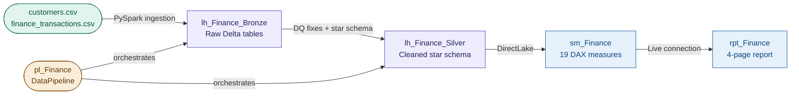
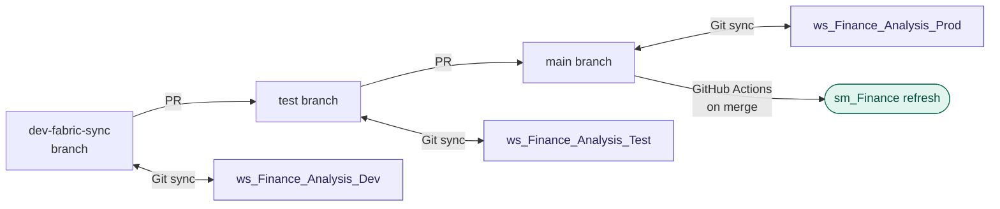

# ws_Finance_Analysis — Finance Analytics Platform

An end-to-end finance analytics platform built entirely from VS Code using Claude Code
and Microsoft Fabric MCP servers — no manual work in the Fabric UI. Covers raw CSV
ingestion, star schema design, a 19-measure DAX library, a four-page Power BI report,
and a three-environment CI/CD pipeline with automated semantic model refresh on every
merge to main.

📝 **Blog post:** [Vibe-coding an end-to-end Finance Analytics Platform in Microsoft Fabric with Claude Code](https://lotusoftware.hashnode.dev/vibe-coding-an-end-to-end-finance-analytics-platform-in-microsoft-fabric-with-claude-code)

---

## The Problem

A finance team needs visibility into transaction patterns, channel performance, fee
structures, and fraud risk across 50,000+ transactions. Existing reporting is manual
and static. The goal is a live executive dashboard with drill-through capability,
built on a governed semantic model that can be promoted through Dev, Test, and
Production environments without manual deployment steps.

---

## Architecture

### CI/CD topology

---

## Key Technical Decisions

**DirectLake over Import mode** — chosen to avoid dataset size penalty on 50K+ rows
while maintaining sub-second query performance. Required `delta.columnMapping.mode=name`
baked into the Silver write to prevent DirectLake framing failures at sync time.

**Star schema in the Silver Lakehouse, not the Gold** — `fact_transactions` with four
conformed dimensions (`dim_customer`, `dim_date`, `dim_channel`, `dim_merchant`) keeps
the semantic model simple and the DirectLake framing clean. `account_id` kept as a fact
attribute — no separate dimension, no attributes beyond the ID.

**TMDL + PBIR format throughout** — all semantic model and report artifacts are stored
as plain-text TMDL and PBIR JSON files, making every measure, relationship, and visual
fully diff-able in Git. No `.pbix` binary in the promotion path.

**Null GUID for same-workspace notebook references in pipeline JSON** —
`workspaceId: 00000000-0000-0000-0000-000000000000` is valid and working for
`pl_Finance` activity bindings. Avoids hardcoding a workspace ID that changes across
Dev/Test/Prod environments.

**Service principal for CI/CD, not the dev MSAL app** — `sp-fabric-cicd` is a
dedicated Entra ID app registration separate from the MCP dev tooling. Uses
`Dataset.ReadWrite.All` delegated scope (Power BI Service has no Application variant
for this permission). Secret rotation due January 2027.

**Table renames via TOM, not TMDL edits** — `powerbi-modeling-mcp` `BatchRename`
cascades renames into all dependent DAX expressions automatically. The 31 PBIR
`Entity` references in visual JSON files were updated separately via find-and-replace
after export — TOM does not touch report files.

---

## What Was Built

| Artifact | Type | Description |
|---|---|---|
| `nb_Finance_Bronze` | Notebook | PySpark — raw CSV → Delta tables in Bronze Lakehouse |
| `nb_Finance_Silver` | Notebook | PySpark — DQ fixes, dedup (69 exact duplicates removed), star schema construction |
| `lh_Finance_Bronze` | Lakehouse | Raw ingestion layer — `customers`, `finance_transactions` as Delta |
| `lh_Finance_Silver` | Lakehouse | Cleaned star schema — `fact_transactions` (50K rows), `dim_customer`, `dim_date`, `dim_channel`, `dim_merchant` |
| `pl_Finance` | DataPipeline | Orchestrates Bronze → Silver notebook execution |
| `sm_Finance` | Semantic model | DirectLake on Silver · 19 DAX measures · 6 display folders · Copilot descriptions · hidden raw columns |
| `rpt_Finance` | Report | 4-page executive dashboard · Layout Trifecta · PBIR format |
| `dp_Finance_Analysis` | Deployment Pipeline | Three-stage Fabric Deployment Pipeline (Dev → Test → Prod) |
| `.github/workflows/fabric-refresh.yml` | GitHub Actions | Triggers `sm_Finance` refresh on every merge to `main` |

---

## Semantic Model — DAX Measure Library

19 measures across 6 display folders, all using `VAR`/`RETURN` pattern with Copilot
descriptions. Raw source columns are hidden; only measures and display-ready columns
are exposed to report authors.

| Display folder | What it answers |
|---|---|
| KPIs | Top-line totals — transaction count, revenue, net revenue |
| Amount | Average ticket, revenue distribution |
| Transaction Volume | Volume trends, period-over-period counts |
| Time Intelligence | MoM and YoY comparisons via `DATEADD`/`SAMEPERIODLASTYEAR` |
| Fees & Tax | Fee rate analysis, tax burden by channel |
| Fraud & Risk | Fraud rate, reversal rate, risk score distribution |

---

## How to Explore This Project

The folder structure mirrors the Fabric workspace exactly — each subfolder is a
synced Fabric artifact stored as plain text.

- **Semantic model:** `sm_Finance.SemanticModel/definition/tables/` contains one
  `.tmdl` file per table including `_Measures.tmdl` with all 19 DAX measures
- **Report:** `rpt_Finance.Report/definition/pages/` contains one folder per page,
  each with `page.json` and a `visuals/` subfolder of individual visual JSON files
- **Pipeline:** `pl_Finance.DataPipeline/pipeline-content.json` shows the full
  activity chain with notebook object IDs
- **CI/CD:** `.github/workflows/fabric-refresh.yml` shows the GitHub Actions
  workflow; the service principal setup is documented in `CONTEXT.md`
- **`CONTEXT.md`** is the agent session handoff document — it records the decisions
  made in each build session, current state, and the next planned step
