# ws_RTI_BicycleRentals — Real-Time Bicycle Network Monitor

A real-time operational intelligence platform monitoring a bicycle rental network via
live event stream processing. Eventstream feeds a KQL medallion architecture (187M rows)
with Bronze, Silver via update policy, and Gold via materialized view. A DirectQuery
semantic model with 10 DAX measures powers a four-page live Power BI dashboard.

<!-- Replace the line below with your screenshot once captured -->
<!--  -->

---

## The Problem

A bicycle rental operator needs live visibility into station availability, capacity
utilisation, and rebalancing requirements across the network — with data arriving every
few seconds. Traditional batch pipelines introduce unacceptable latency for operational
decisions. The goal is a streaming architecture that processes events in-flight, stores
them for historical analysis, and surfaces current station state in a Power BI dashboard
that refreshes without manual intervention.

---

## Architecture

```mermaid
flowchart LR
    A([Live Event\nStream]) -->|Eventstream| B[eh_RTI_BicycleRentals\nEventhouse]
    B --> C[KQL Database\nBronze: RawData\n187M rows]
    C -->|Update Policy\nTransformRawData| D[Silver: TransformedData]
    D -->|Materialized View\nagg by station| E[Gold: AggregatedData]
    D -->|arg_max function\nLatestStationSnapshot| F[Station Snapshot\ncurrent state]
    E --> G[sm_RTI_BicycleRentals\n10 DAX measures]
    F --> G
    G -->|DirectQuery\nto KQL| H[rpt_RTI_BicycleRentals\n4-page live dashboard]

    style A fill:#E1F5EE,stroke:#0F6E56,color:#085041
    style B fill:#EEEDFE,stroke:#534AB7,color:#26215C
    style C fill:#EEEDFE,stroke:#534AB7,color:#26215C
    style D fill:#EEEDFE,stroke:#534AB7,color:#26215C
    style E fill:#EEEDFE,stroke:#534AB7,color:#26215C
    style F fill:#EEEDFE,stroke:#534AB7,color:#26215C
    style G fill:#E6F1FB,stroke:#185FA5,color:#0C447C
    style H fill:#E6F1FB,stroke:#185FA5,color:#0C447C
```

---

## Key Technical Decisions

**KQL medallion via update policies and materialized views — not Lakehouse** — for
sub-second streaming data, KQL's native update policy (`TransformRawData()` function)
transforms and promotes rows from Bronze to Silver inline as they arrive. No Spark job,
no scheduling latency. The Gold layer is a KQL materialized view — pre-aggregated by
station, maintained automatically by the engine.

**`LatestStationSnapshot()` KQL function for current station state** — `AggregatedData`
(the materialized view) only carries `No_Bikes` per station. To expose the full current
station snapshot (capacity, docks, location, status), a separate KQL function uses
`arg_max(Timestamp, *)` over `TransformedData` to return the most recent row per
station. This becomes the `Station Snapshot` table in the semantic model — solving the
schema gap without duplicating the materialized view.

**DirectQuery to KQL Database — not DirectLake or Import** — the semantic model connects
directly to the KQL Database via DirectQuery. This means every report interaction
queries live KQL data. No refresh schedule, no dataset lag. The trade-off is that all
DAX must translate to KQL — measures are written with this constraint in mind.

**`joinOnDateBehavior: DatePartOnly` not needed here** — unlike the USGS model,
timestamps in the KQL-backed model are handled natively by the DirectQuery engine.
KQL's `datetime` type maps cleanly without the bridging property required for
DirectLake.

**Separate Eventhouse and Eventstream artifacts** — `eh_RTI_BicycleRentals` is the
Eventhouse container holding the KQL Database. The Eventstream feeds it. These are
distinct Fabric artifact types that appear as siblings in the workspace — always filter
on `type` when listing workspace artifacts via MCP to avoid acting on the wrong one.

---

## What Was Built

| Artifact | Type | Description |
|---|---|---|
| `eh_RTI_BicycleRentals` | Eventhouse | Container for the KQL Database |
| KQL Database | KQL Database | Three-layer medallion: `RawData` (Bronze), `TransformedData` (Silver via update policy), `AggregatedData` (Gold via materialized view) |
| `TransformRawData()` | KQL Function | Update policy function — transforms and promotes Bronze rows to Silver inline on ingestion |
| `LatestStationSnapshot()` | KQL Function | Returns current state per station via `arg_max(Timestamp, *)` over Silver — fills the schema gap in the Gold materialized view |
| `activator_BicycleRentals` | Reflex | Alert/activator artifact — rule logic defined in Fabric |
| `dashboard_BicycleRentals` | KQL Dashboard | Native KQL dashboard tiles |
| `anomalies_BicycleRentals` | Anomaly Detector | Anomaly detection over the event stream |
| `sm_RTI_BicycleRentals` | Semantic model | DirectQuery to KQL · 10 DAX measures · 4 display folders · Copilot descriptions |
| `rpt_RTI_BicycleRentals` | Report | 4-page live dashboard · PBIR format · 0 validation errors |

---

## Semantic Model — DAX Measure Library

10 measures across 4 display folders. All measures are written to translate cleanly
through the DirectQuery-to-KQL engine. Raw columns hidden; only measures and key
dimension columns exposed.

| Display folder | What it answers |
|---|---|
| Availability | Current and average bike availability per station |
| Capacity | Total docks, utilisation rate across the network |
| Rebalancing | Stations below threshold — candidates for bike redistribution |
| Recency | Time since last event per station — data freshness indicator |

---

## Report Pages

| Page | Focus |
|---|---|
| Live Network Overview | Network-wide KPIs, availability distribution, map of all stations |
| Station Detail | Per-station drill-through — capacity, availability trend, last event time |
| Rebalancing Ops | Stations flagged for rebalancing, sorted by urgency |
| About | Data model documentation, refresh behaviour, data source reference |

---

## How to Explore This Project

- **KQL medallion:** The Bronze/Silver/Gold structure, update policy function, and
  materialized view definition live in the Eventhouse artifact in the Fabric workspace —
  not as files in this repo (KQL Database definitions are not Git-synced as plain text
  in the current Fabric Git integration)
- **Semantic model:** `sm_RTI_BicycleRentals.SemanticModel/definition/tables/` —
  TMDL files including `_Measures.tmdl` with all 10 DAX measures and the
  `Station Snapshot` table sourced from `LatestStationSnapshot()`
- **Report:** `rpt_RTI_BicycleRentals.Report/definition/pages/` — PBIR visual JSON
  per page
- **`CONTEXT.md`** is the agent session handoff document — records the KQL architecture
  decisions, the `LatestStationSnapshot()` fix, and current open items
