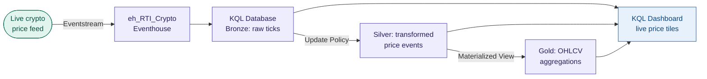

# ws_RTI_Crypto — Live Crypto Price Intelligence

A real-time intelligence platform ingesting live cryptocurrency price data every few
seconds via Eventstream, processing it in-stream, storing it for historical analysis,
and exposing it via KQL queries and native KQL dashboards.

> **Status: Paused** — this workspace is currently disconnected from Git due to a
> `Git_GitProviderCommitRejectedByPolicy` error isolated to this workspace only
> (request ID: `1e57bbf7-fa24-4989-b4e4-caf3f5048441`). All workspace artifacts are
> intact in Fabric. A Microsoft support ticket has been raised. Work will resume once
> the Git block is resolved.

---

## The Problem

Cryptocurrency prices move in seconds. Traditional batch analytics cannot capture
intraday volatility patterns or support operational queries against live price state.
The goal is a streaming architecture that ingests tick-level price events, stores them
efficiently in a KQL Database for both real-time and historical querying, and surfaces
insights via KQL dashboards — demonstrating the Fabric Real-Time Intelligence stack on
a fast-moving financial data source.

---

## Intended Architecture

---

## What Was Built Before the Block

| Artifact | Type | Status |
|---|---|---|
| Eventstream | Eventstream | Live crypto feed ingestion configured |
| `eh_RTI_Crypto` | Eventhouse | Created, KQL Database provisioned |
| KQL Database | KQL Database | Streaming data received and stored |
| KQL Dashboard | KQL Dashboard | Dashboard tiles built on live KQL queries |

The workspace artifacts are intact in Fabric. The Git block prevents committing
workspace state to the repo — the folder in this repo reflects the last successfully
synced state before the block occurred.

---

## How to Explore This Project

- **Workspace ID:** `ee6aad63-922c-4939-b029-95d87c276da8` (North Europe, Trial capacity)
- The KQL Database, Eventstream, and dashboard exist live in the Fabric workspace
  and are accessible via the Fabric portal
- Once the Git block is resolved, the workspace will be reconnected and the full
  artifact state will be committed — the architecture and KQL layer design will be
  documented at that point
- **`CONTEXT.md`** records the Git error details, workspace ID, and next steps
