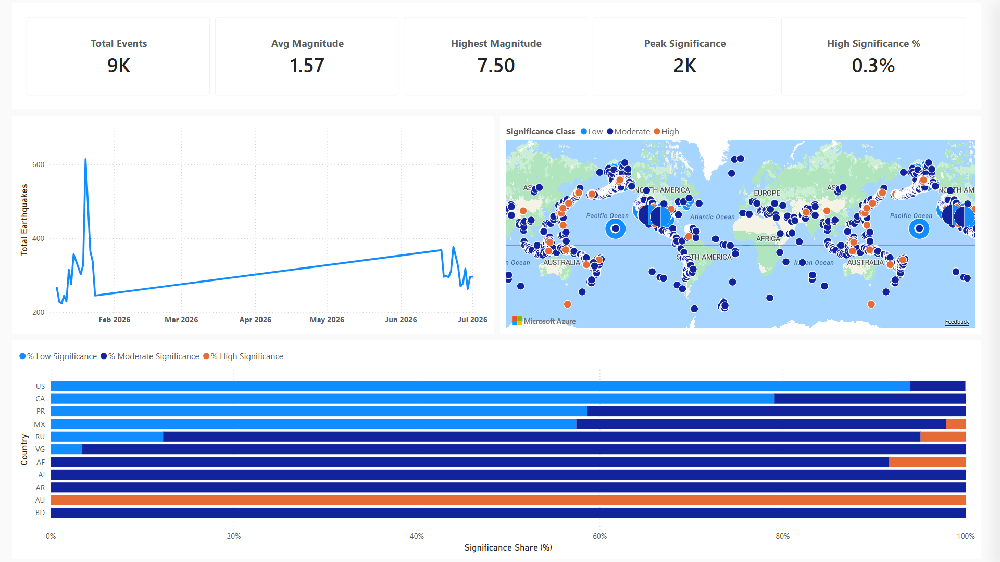
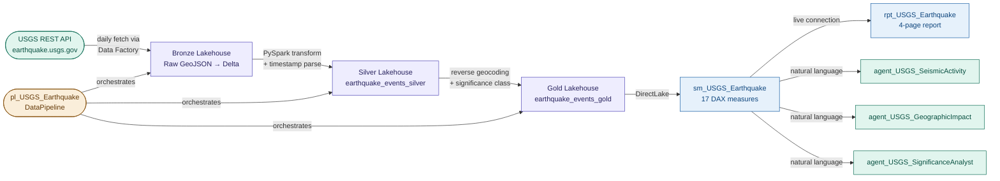

# ws_USGS_Earthquake — USGS Earthquake Analytics

An end-to-end analytics platform on Microsoft Fabric ingesting live earthquake data
from the USGS REST API, processing it through a Bronze → Silver → Gold medallion
architecture with reverse geocoding and significance classification, surfacing it as
a four-page Power BI geospatial report with time intelligence, and enabling natural
language querying through three domain-scoped Fabric Data Agents.

---

## The Problem

Seismic activity data is publicly available but raw — thousands of events per week with
no geographic enrichment, no significance categorisation, and no time-series structure
ready for reporting. The goal is a governed analytics platform that ingests daily USGS
data automatically, enriches it with country-level geography, classifies events by
significance, presents it in a report that answers: where are earthquakes happening,
how significant are they, and how is activity trending over time? — and lets business
users query the data in plain language through domain-scoped agents.

---

## Architecture

---

## Key Technical Decisions

**Reverse geocoding via `reverse_geocoder` library in a Fabric Environment** — the Gold
notebook enriches each event with a two-letter country code using latitude/longitude.
`%pip install` is blocked in Fabric pipeline execution, so `reverse_geocoder 1.5.1` is
pre-installed in `env_USGS_Earthquake` (a dedicated Fabric Environment artifact) and
attached to the notebook. This is the production-safe pattern for custom Python packages
in Fabric.

**Significance classification as a derived Gold column** — USGS provides a raw numeric
significance score. The Gold layer adds `sig_class` (Low / Moderate / High) based on
fixed thresholds (`< 100` / `100–499` / `≥ 500`). This keeps the semantic model clean —
report slicers use the categorical column, measures aggregate the numeric score.

**`delta.columnMapping.mode=name` baked into the Gold write** — required at write time
to prevent DirectLake framing failures at schema sync. Cannot be retrofitted after the
table exists.

**`joinOnDateBehavior: DatePartOnly` on the date relationship** — `Earthquake Events[Event Time]`
is `TimestampType`; `Date[Date]` is `DateType`. Without this property the relationship
fails to bridge the two types in DirectLake mode. The Date dimension spans 2024–2027 to
cover the full pipeline window.

**Three domain-scoped Fabric Data Agents on one semantic model** — rather than one
general-purpose agent, three agents are grounded on `sm_USGS_Earthquake` with distinct
measure scopes and explicit refusal boundaries. Each agent redirects out-of-scope
questions to the correct peer agent by name. This mirrors the Aalto EE governance-first
multi-agent pattern.

**Null GUID for same-workspace notebook references** — `pl_USGS_Earthquake` references
Bronze, Silver, and Gold notebooks using `workspaceId: 00000000-0000-0000-0000-000000000000`.
This resolves correctly at runtime to whichever workspace the pipeline runs in, making
the pipeline JSON environment-agnostic.

**Data Factory parameters for rolling 7-day window** — the pipeline passes `start_date`
and `end_date` as expressions (`utcNow() - 7 days` and `utcNow()`) to the Bronze
notebook. The Silver and Gold notebooks receive `start_date` and filter accordingly,
preventing full-table reprocessing on every run.

---

## What Was Built

| Artifact | Type | Description |
|---|---|---|
| `nb_USGS_Earthquake_Bronze` | Notebook | Fetches GeoJSON from USGS REST API for a date range, writes raw JSON to Lakehouse Files |
| `nb_USGS_Earthquake_Silver` | Notebook | Parses GeoJSON, extracts coordinates/properties, converts epoch milliseconds to timestamps, appends to `earthquake_events_silver` |
| `nb_USGS_Earthquake_Gold` | Notebook | Reverse geocodes lat/lon → country code, adds significance classification, appends to `earthquake_events_gold` |
| `nb_USGS_Earthquake_Date` | Notebook | Generates `DateDimension` table (2024–2027) with Year, Quarter, Month, Day, Weekday, IsWeekend columns |
| `lh_USGS_Earthquake` | Lakehouse | Single Lakehouse holding all three medallion layers as Delta tables under `dbo` schema |
| `pl_USGS_Earthquake` | DataPipeline | Orchestrates Bronze → Silver → Gold with rolling 7-day date window parameters |
| `env_USGS_Earthquake` | Environment | Fabric Environment with `reverse_geocoder 1.5.1` pre-installed |
| `sm_USGS_Earthquake` | Semantic model | DirectLake on Gold · 17 DAX measures · 5 display folders · Copilot descriptions |
| `rpt_USGS_Earthquake` | Report | 4-page geospatial dashboard · PBIR format |
| `agent_USGS_SeismicActivity` | Data Agent | Fabric Data Agent — time-series trends, event volume, magnitude analysis |
| `agent_USGS_GeographicImpact` | Data Agent | Fabric Data Agent — country-level patterns, geographic distribution |
| `agent_USGS_SignificanceAnalyst` | Data Agent | Fabric Data Agent — significance scoring, risk classification |

---

## Semantic Model — DAX Measure Library

17 measures across 5 display folders, all with Copilot descriptions. Raw source columns
hidden; `Latitude`, `Longitude`, `Country Code`, and `Significance Class` exposed for
map and slicer visuals.

| Display folder | What it answers |
|---|---|
| Volume | Total earthquake count in the current filter context |
| Magnitude | Average, maximum, and minimum magnitude; Magnitude Band classification |
| Significance | Average significance score, maximum significance, % classified as High/Moderate/Low |
| Time Intelligence | MTD, prior month, MOM %, 7-day rolling count |
| Time | Earliest and latest event date in the selection |

---

## Fabric Data Agents

Three domain-scoped agents grounded on `sm_USGS_Earthquake`, each with explicit
refusal boundaries that redirect out-of-scope questions to the correct peer agent.

| Agent | Scope | Sample questions |
|---|---|---|
| `agent_USGS_SeismicActivity` | Volume and magnitude trends over time | "How many M5+ events occurred this month?" / "What is the 7-day rolling count?" |
| `agent_USGS_GeographicImpact` | Country-level distribution and location patterns | "Which countries had the most earthquakes?" / "Show me activity in Japan" |
| `agent_USGS_SignificanceAnalyst` | USGS significance scoring and risk classification | "What % of events were High significance?" / "What was the peak significance score?" |

---

## Key Insights from the Data

- **9K earthquake events recorded** across the dataset window (Jan 2026 – Jul 2026)
- **US dominates at 8,087 events** — the vast majority of recorded activity, driven by
  Alaska and California seismic zones
- **Max magnitude: M 7.50** — the strongest single event in the dataset
- **85.8% of events classified as Low significance** — most activity is minor seismic
  noise; only 0.3% reaches High significance (USGS score ≥ 500)
- **Russia and Afghanistan show the highest proportion of High significance events** —
  visible in the Significance Distribution by Country chart
- **Activity spiked in January 2026** reaching over 600 events in a single day, then
  stabilised at 200–350 events per day through mid-year

---

## Report Pages

| Page | Key visuals |
|---|---|
| Overview Dashboard | KPI card strip (5 measures), daily event line chart, combo chart (avg magnitude + count by date) |
| Time Intelligence | MTD, MOM %, 7-day rolling count, monthly volume bar chart, significance class donut |
| Geographic Distribution | Global map with significance class bubbles, top-15 country bar chart, significance stacked bar by country |
| Event Detail | Drill-through table — Title, Event Time, Magnitude, Significance Class, Country Code, Place Description |

---

## How to Explore This Project

- **Medallion notebooks:** `nb_USGS_Earthquake_Bronze/Silver/Gold.Notebook/notebook-content.py` — full PySpark transformation logic including the reverse geocoding UDF pattern
- **Date dimension:** `nb_USGS_Earthquake_Date.Notebook/notebook-content.py` — standalone date table generator
- **Semantic model:** `sm_USGS_Earthquake.SemanticModel/definition/tables/` — TMDL files for `Earthquake Events`, `Date`, and `_Measures`
- **Pipeline:** `pl_USGS_Earthquake.DataPipeline/pipeline-content.json` — rolling window parameter expressions
- **Report:** `rpt_USGS_Earthquake.Report/definition/pages/` — PBIR visual JSON per page
- **Data Agents:** open any of the three agents in the Fabric workspace and ask questions in plain language
- **`CONTEXT.md`** is the agent session handoff document — records build decisions, current state, and next planned step